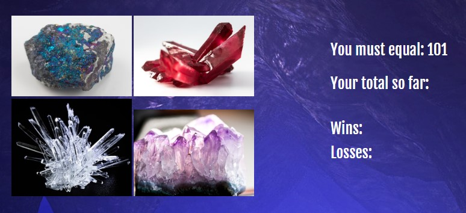
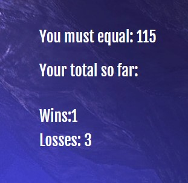

# Crystal Collector

Crystal Collector Game - jQuery based.

A game in which the user must select crystals with hidden numerical values to add up to number shown on screen.  

## How to Play
Instructions are listed:

This is the starting screen displayed. Number generated on screen is random. This is the number the user needs to equal to. As user clicked on each crystals, those numbers will add up and that total is visible as "Your total so far". Wins and loss are also tracked. 

 The game will reset per win and per loss. The number generated will then reset as well, displaying a new number.  The numbers of wins and losses will stay on screen. Per reset, "Your total so far" will always empty.  

Play the game: https://mhvue.github.io/unit-4-game

